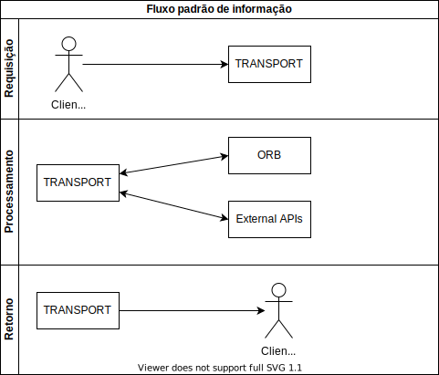

Bem vindo a documentação da API do TRANSPORT! Aqui estão listadas as funcionalidades implementadas da API para consulta e desenvolvimento de software que interaja com a mesma.

O serviço TRANSPORT foca no gerenciamento de viagens entre pontos sendo da sua alçada:
* Controlar rotas
* Controlar viagens nessas rotas
* Controlar os pontos de parada das viagens
* Controlar os passageiros em cada viagem
* Controlar os passageiros entre pontos de parada, verificando quem embarca e quem desembarca em cada ponto

Coisas que o TRANSPORT **NÂO FAZ**:
* Venda de viagens
* Cadastro de passageiros
* Cadastro de motoristas
* Cadastro de empresas

O sistema tem algumas entidades:
* [Route](route.md) 
* [Trip](trip.md)
* [Stop Point](stop_point.md)
* [Driver](driver.md)
* [Company](company.md)
* [Passenger](passenger.md)

O Fluxo padrão de requisições deve sempre ser intermediado pelo transport.
Sendo assim, consultas de passageiros, empresas, motoristas, rotas, viagens, e vagas devem obrigatóriamente passar pelo Transport e nunca ir diretamente a sistemas terceiros (ex diretamente ao ORB)

O Transport depende do ORB para consulta de informações de cadastro sendo necessário que estas informações relacionadas a essas entidades estejam disponiveis para o consumo via API.
* Passageiros (Leitura)
* Motoristas (Leitura)
* Empresas (Leitura)
* Services (Leitura/Escrita/Atualização)
* Mapa de vagas (Leitura/Escrita/Atualização)

Na API temos a documentação dos endpoints utilizando swagger, disponivel em [LOCAL](http://localhost:5000)