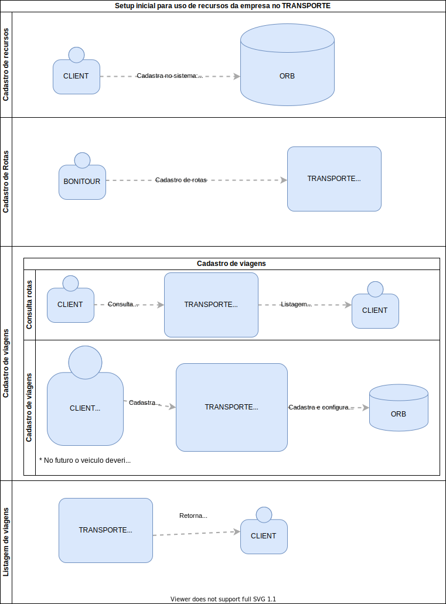
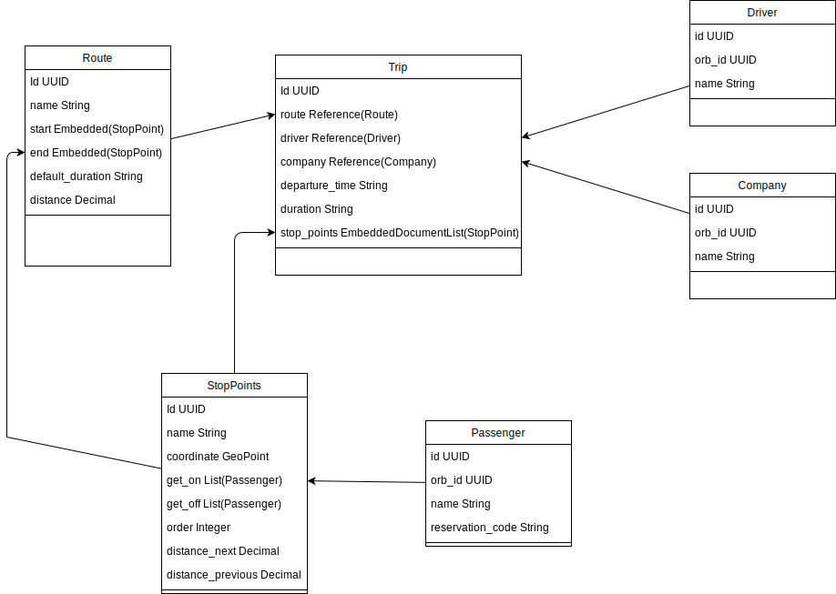
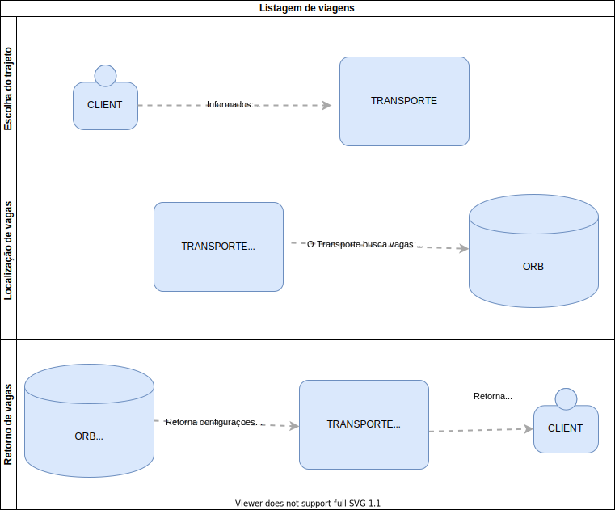

Bem vindo a documentação da API do **TRANSPORTE**! Aqui estão listadas as funcionalidades implementadas da API para consulta e desenvolvimento de software que interaja com a mesma.

O serviço **TRANSPORTE** foca no gerenciamento de viagens entre pontos sendo da sua alçada:
* Controlar rotas
* Controlar viagens nessas rotas
* Controlar os pontos de parada das viagens
* Controlar os passageiros em cada viagem
* Controlar os passageiros entre pontos de parada, verificando quem embarca e quem desembarca em cada ponto

Coisas que o **TRANSPORTE** **NÂO FAZ**:
* Venda de viagens
* Cadastro de passageiros
* Cadastro de motoristas
* Cadastro de empresas

O sistema tem algumas entidades:
* [Route](route.md) 
* [Trip](trip.md)
* [Stop Point](stop_point.md)
* [Driver](driver.md)
* [Company](company.md)
* [Passenger](passenger.md)

O Fluxo padrão de requisições deve sempre ser intermediado pelo **TRANSPORTE**.
Sendo assim, consultas de passageiros, empresas, motoristas, rotas, viagens, e vagas devem obrigatóriamente passar pelo **TRANSPORTE** e nunca ir diretamente a sistemas terceiros (ex diretamente ao ORB)

O **TRANSPORTE** depende do ORB para consulta de informações de cadastro sendo necessário que estas informações relacionadas a essas entidades estejam disponiveis para o consumo via API.
* Passageiros (Leitura)
* Motoristas (Leitura)
* Empresas (Leitura)
* Services (Leitura/Escrita/Atualização)
* Mapa de vagas (Leitura/Escrita/Atualização)

Na API temos a documentação dos endpoints utilizando swagger, disponivel em [DESENVOLVIMENTO LOCAL](http://localhost:5000)

# Configuração inicial e utilização do **TRANSPORTE**

O Serviço do transporte depende de dados do ORB sendo assim alguns cadastros devem ser feitos com antecedência para que o sistema possa funcionar

1. Cadastro de rotas
    - O Transporte depende de trajetos pré cadastrados para que as viagens sejam criadas e as associações sejam feitas corretamente
    1. **BINAMIK** cadastra rotas no **TRANSPORTE**  
1. Cadastro de viagens
    1. **Cliente** cadastra no **ORB**:
        1. Veiculos
        1. Motoristas
    1. **Cliente** acessa interface feita para utilização do **TRANSPORTE**
        1. Seleciona uma rota
        1. Seleciona uma data
            1. Seleciona um horario
            1. Seleciona um veiculo
            1. Seleciona um motorista
            1. Seleciona o numero de vagas
            - *Futuramente o numero de vagas deve ser vinculado pelo veiculo selecionado
            * Esse passo deve ser repetido para cada uma das viagens que se deseja cadastrar
1. Venda para passageiros
    1. **Empresa** cadastra os passageiros no orb
        * Precisamos dos dados de todos os passageiros para vincula-los corretamente aos lugares nos veiculos e suas respectivas paradas
    1. É selecionada a viagem
    1. Efetiva-se a reserva no **ORB** 

# Diagramas
## Setup Inicial

## Fluxo padrão de informação

## Diagramas de classe 

## Listagem de viagens
